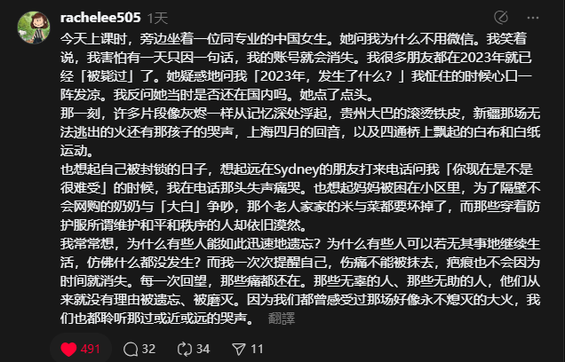
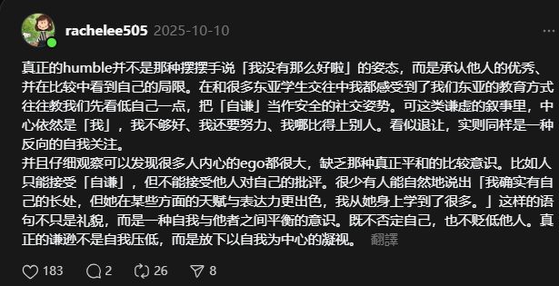

+++
date = '2025-10-18T15:32:10+08:00'
draft = false
title = 'threads的摘抄'
categories = ["threads"]
tags = ["摘抄"]
+++

计划在这个页面记录threads的摘抄内容
-----
1.随着时间的推移，好像成长像一种缓慢的消耗。我变成了动物，如果真诚和真心耗竭了一次，我就需要要冬眠很久才能重振旗鼓。我遇见有点心动的人，好像也会在权衡距离、时差，未来过后，在心里摇头:你会遇到更好的人，不是我。我学会把情感安放在地下凝视距离与时差，看彼此在不同轨道上渐行渐远，心里掀起的波澜一次比一次小。我不知道长大到底意味着什么，或许长大就是接受自己失去的同时，也同样学习如何拥抱自己的怯懦。 

2.真正的谦逊

